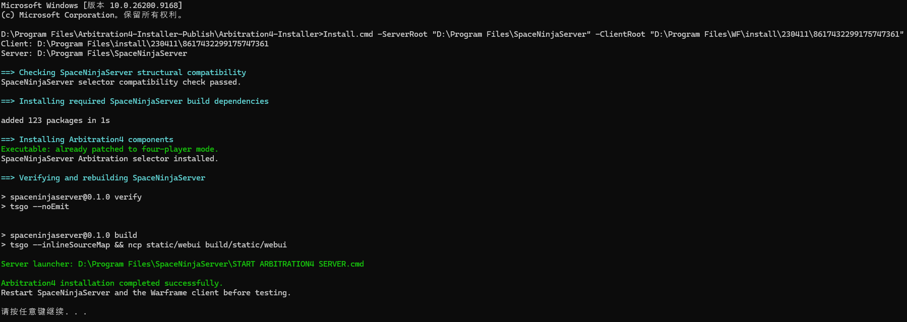

# Arbitration4 Installer

Installs the following additional features for OpenWF:

1. Forces the two player-count return values used by supported clients for normal mission spawning and script player-count checks to 4.
2. Forces the player count read by the Arbitration Drone spawning logic in `LotusGameRules.lua` to 4.
3. Adds Arbitration node, mission type, and faction override controls to the SpaceNinjaServer WebUI, format is the same as `https://browse.wf/arbys`. **To show this, your account must be the administrator**.

## Important Limitations
- This tool **Only support 2026.05.13.13.07/k5j - 42.0.11 version.**
- This tool **installs the modifications only; it does not uninstall them**.
- To remove the client modifications, restore an original `Warframe.x64.exe` from the same game version and remove the Content Replacement files generated by this tool whose names and hashes match.
- To remove the server modifications, run the update process included with SpaceNinjaServer to resynchronize its source code.
- The client portion supports only the versions and SHA-256 hashes explicitly listed by the tool. It will not force modifications onto an unknown EXE or unknown Lua file.
- The server portion is not pinned to a single Git commit, but it must pass structural compatibility checks.

## Requirements
- Windows powershell
- A complete OpenWF client installation, including `Warframe.x64.exe` and `Cache.Windows`.
- A complete SpaceNinjaServer source tree with its npm dependencies installed.
- Internet access on the first run to download the pinned version of Warframe Exporter and verify its SHA-256 hash.

## Usage

Completely exit the Warframe client and SpaceNinjaServer:

```cmd
Install.cmd -ServerRoot "D:\Program Files\SpaceNinjaServer" -ClientRoot "D:\Program Files\WF\install\230411\8617432299175747361"
```
replaced "D:\Program Files\SpaceNinjaServer" and "D:\Program Files\WF\install\230411\8617432299175747361" for your own path.



After a successful installation, `START ARBITRATION4 SERVER.cmd` will be created in the server root directory. Use that script to start the server from then on. It starts only the already-built server; it does not run Git updates or overwrite the Arbitration4 server modifications.

**Do not use `UPDATE AND START SERVER.bat` unless you intend to remove the server modifications through an update.**

You can explicitly specify the installation directories by powershell:

```powershell
powershell.exe -NoProfile -ExecutionPolicy Bypass -File .\Arbitration4.ps1 `
  -ClientRoot "D:\Program Files\WF\install\230411\8617432299175747361" `
  -ServerRoot "D:\Program Files\WF\SpaceNinjaServer"
```

The installer follows a fail-fast policy. It writes changes only after every input file has passed its version, structure, and hash checks.

## Distribution Notice

This package does not include Warframe client files, modified executables, unpacked game Lua files, or the complete SpaceNinjaServer source code.
